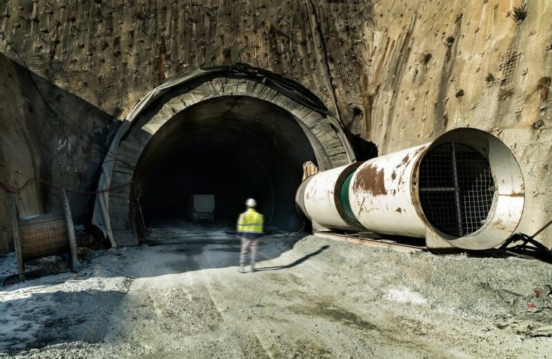

## 들어가며

고전역학에서는 입자의 에너지 $E$가 장벽의 높이 $V_0$보다 낮으면 절대로 통과할 수 없습니다.
하지만 양자역학에서는 **파동함수가 장벽 너머로 지수적으로 감쇠하며 침투**하기 때문에,
유한한 확률로 투과가 일어납니다. 이것이 **양자 터널링(quantum tunneling)** 입니다.

---

## 1. 문제 설정

아래 그림과 같이 $0 < x < a$ 구간에 높이 $V_0$의 직사각형 포텐셜 장벽이 있다고 합시다.

$$
V(x) = \begin{cases} 0 & (x < 0) \\ V_0 & (0 \leq x \leq a) \\ 0 & (x > a) \end{cases}
$$

에너지 $E < V_0$인 입자가 왼쪽에서 입사하는 상황을 다룹니다.

---

## 2. 각 영역에서의 파동함수

### 영역 I: $x < 0$ (입사 + 반사)

$$
\psi_I = A e^{ikx} + B e^{-ikx}, \qquad k = \frac{\sqrt{2mE}}{\hbar}
$$

### 영역 II: $0 \leq x \leq a$ (장벽 내부)

$E < V_0$이므로 파동함수는 **지수 감쇠**합니다:

$$
\psi_{II} = Ce^{\kappa x} + De^{-\kappa x}, \qquad \kappa = \frac{\sqrt{2m(V_0-E)}}{\hbar}
$$

### 영역 III: $x > a$ (투과)

$$
\psi_{III} = F e^{ikx}
$$

---

## 3. 투과 계수

경계 조건(연속성 + 미분 연속성)을 적용하면 **투과 계수** $T$를 구할 수 있습니다.

$\kappa a \gg 1$ 극한(두꺼운 장벽)에서:

$$
T \approx e^{-2\kappa a} = \exp\!\left(-\frac{2a}{\hbar}\sqrt{2m(V_0 - E)}\right)
$$

> **핵심**: 투과 확률은 장벽 두께 $a$와 $\sqrt{V_0 - E}$에 **지수적으로** 감소합니다.

---

## 4. 응용 사례

| 현상 | 설명 |
|------|------|
| **알파 붕괴** | 원자핵 내 알파 입자가 쿨롱 장벽을 터널링하여 방출 |
| **주사 터널링 현미경(STM)** | 탐침과 시료 사이 전자 터널링으로 원자 분해능 영상 |
| **핵융합** | 태양 내부에서 양성자들이 쿨롱 장벽을 넘어 융합 |
| **터널 다이오드** | 반도체 소자에서 전자 터널링 활용 |

---

## 마치며

양자 터널링은 양자역학의 가장 반직관적인 현상 중 하나입니다.
다음 글에서는 **WKB 근사법**으로 임의 형태의 장벽에 대한 터널링 확률을 구해보겠습니다.
